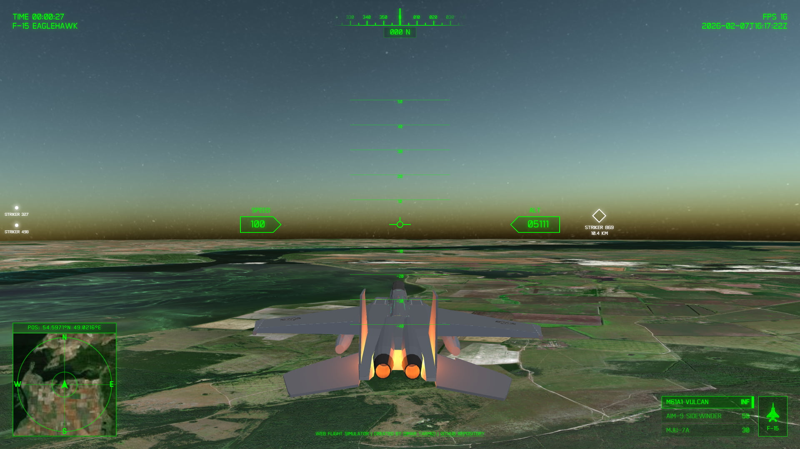

<p align="center">
  
</p>

# ✈️ Web Flight Simulator

[](https://developer.mozilla.org/en-US/docs/Web/HTML) [](https://developer.mozilla.org/en-US/docs/Web/CSS) [](https://developer.mozilla.org/en-US/docs/Web/JavaScript) [](https://threejs.org/) [](https://cesium.com/) [](https://vitejs.dev/)

A high-performance, web-based flight simulator that bridges the gap between **Three.js** high-fidelity 3D modeling and **CesiumJS** global-scale geospatial data. Experience the thrill of piloting an F-15 fighter jet across a real-time, 3D replica of the Earth.



## 🚀 Key Features

### 🌍 Global Real-World Terrain
- **Digital Twin Earth**: Powered by CesiumJS, fly over high-resolution 3D topography and satellite imagery anywhere on the planet.
- **Dynamic Level-of-Detail**: Seamlessly transition from high-altitude stratospheric flight to low-level canyon runs.

### 🦅 Advanced Flight Combat & AI
- **F-15 Eaglehawk**: Optimized 3D model featuring dynamic afterburners and jet flame effects.
- **Weapon System**:
  - **M61A1 Vulcan**: High-speed internal cannon for close-range dogfights.
  - **AIM-9 Sidewinder**: Heat-seeking missiles with active target locking.
  - **MJU-7A Flares**: Advanced countermeasure system to evade incoming threats.
- **NPC Entities**: Encounter other aircraft in the world. AI flight behaviors and randomized callsigns are currently under development.

### 🖥️ Tactical HUD & UI
- **Professional Avionics**: A fully integrated Heads-Up Display (HUD) featuring:
  - Pitch Ladder and Heading Tape.
  - Real-time Altitude (ASL) and Airspeed (IAS) indicators.
  - Weapon Status and Ammo tracking.
  - Interactive Minimap with satellite navigation.

## ⚙️ Configuration & Options

The simulator allows customization of the flight experience through the in-game settings menu:

- **Graphics Quality**: Adjustable settings for performance tuning (rendering resolution and detail).
- **Antialiasing**: Enable/disable smoothing for jagged edges on the 3D model.
- **Fog Effects**: Toggle atmospheric fog for better immersion and depth perception.
- **Mouse Sensitivity**: Fine-tune the "Look Around" sensitivity for the tactical camera.
- **Sound Toggle**: Global master switch for all game audio.
- **Persistent Settings**: All choices are automatically saved to `localStorage` for future sessions.

## 🔊 Immersive Audio System

A complex sound environment is built using the `Three.js AudioListener` system:

- **Dynamic Engine Noises**: Realistic jet engine loops that react to throttle changes.
- **Wind & Aerodynamics**: Procedural wind sounds based on flight speed.
- **Tactical Warnings (GPWS/RWR)**:
  - **"PULL UP"**: Ground Proximity Warning System for terrain avoidance.
  - **Radar Warnings**: Distinct tones for target search (TWS) and active missile locks.
- **Combat SFX**: High-fidelity sounds for M61 Vulcan firing, missile launches, and randomized explosion variants.
- **Atmospheric UI**: Subtle button hovers, clicks, and screen glitch transitions for a modern tactical interface.

## ⌨️ Controls & Handling

| Category | Action | Key |
| :--- | :--- | :--- |
| **Flight** | Pitch Up / Down | `Arrow Down` / `Arrow Up` |
| | Roll Left / Right | `Arrow Left` / `Arrow Right` |
| | Yaw (Rudder) | `A` / `D` |
| | Increase / Decrease Throttle | `W` / `S` |
| | Afterburner (Boost) | `Space` |
| **Combat** | Fire Active Weapon | `Enter` or `F` |
| | Deploy Flares | `V` |
| | Select Weapon | `1` / `2` |
| | Cycle Weapon | `Q` |
| **View** | Look Around | `Mouse Left Drag` |

## 🛠️ Technical Overview

The project utilizes a **Hybrid Rendering Architecture**:
- **CesiumJS** handles the massive planetary scales, WGS84 coordinates, and terrain streaming.
- **Three.js** manages the local coordinate system for the aircraft model, particle effects (jet flames, explosions), and lighting.
- **Vite** provides an ultra-fast HMR development environment and optimized production builds.

## 📦 Installation & Setup

1. **Clone the repository:**
   ```bash
   git clone https://github.com/dimartarmizi/web-flight-simulator.git
   cd web-flight-simulator
   ```

2. **Install dependencies:**
   ```bash
   npm install
   ```

3. **Run development server:**
   ```bash
   npm run dev
   ```

4. **Build for production:**
   ```bash
   npm run build
   ```

## 📜 License

This project is licensed under a **Dual-Licensing** model:

- **Non-Commercial:** Free to use for personal, educational, and non-profit projects.
- **Commercial:** Requires a separate commercial license for any for-profit use.

Please refer to the [LICENSE](LICENSE) file for full legal terms or contact [dimartarmizi@email.com](mailto:dimartarmizi@email.com) for inquiries.

## 🏷️ Credits

- **Developer**: Dimar Tarmizi
- **3D Model**: ["Low poly F-15"](https://sketchfab.com/3d-models/low-poly-f-15-0c1cfa22d7094556914fcdfba75bef5d) by [SIpriv](https://sketchfab.com/sipriv).
- **Engine**: [Three.js](https://threejs.org/) & [CesiumJS](https://cesium.com/).
